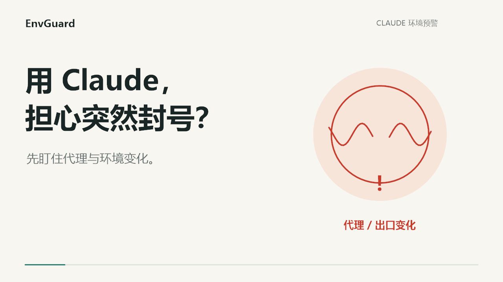

# EnvGuard：环境变了提醒你，出问题一键关软件

用软件时担心代理突然掉线，或者电脑设置被改了？EnvGuard 就是帮你盯着这些变化的小工具。

你先把环境准备好，让它记住这份设置。以后发现不一样，它会提醒你；需要停下来时，点红色按钮，强制关闭你选好的软件。提醒原因和关闭结果都会尝试写进日志，方便回头查。

**先说清楚：它不会自动关软件，也不会自动断网或拦住软件启动。它是“提醒 + 手动紧急关闭”，不是防泄露或不封号的保证。**

## 去哪里下载？

打开 [下载页](https://github.com/xiesjdyka/EnvGuard/releases/latest)，下载 `EnvGuard-windows-x64.zip`，解压后双击 `EnvGuard.exe`。

适用于 64 位 Windows，需要 .NET Framework 4.8。**直接双击就会自动请求管理员权限，不用每次右键。** 在 Windows 权限提示中点“是”后启动监测；取消则不启动。紧急关闭时不用再等一次权限弹窗。程序还没有商业签名，请认准这个仓库的发布文件；不要为了运行它而关闭安全软件。

## 先看一段演示

[观看 28 秒演示：连续动效 + 音效，没有配音](media/EnvGuard-Claude.mp4)。画面为功能示意；原创画面和音效的生成源码在 [media/Promo.cs](media/Promo.cs)。

## 第一次怎么弄？

1. **先把代理连好。** 确认现在用的是你想要的出口，时区和区域设置也符合你的实际需要。不要在掉线时保存设置。
2. **选要保护的软件。** 比如 Claude，也可以选别的软件。如果出问题时想连 Chrome 一起关，就把 Chrome 另外加进去。
3. **看清楚会关哪些东西。** 软件有自己的专用安装文件夹时，可以勾选它；专属后台服务也要单独勾选。别把整个磁盘或公共文件夹选进去。关闭 Chrome 可能连其他 Chrome 窗口也一起关。
4. **点“下一步：配环境”。** 对照 v2rayN 左下角的本机 `mixed` 端口：比如 `[mixed:10808]` 就填 `10808`。这里不是填卖家给的远程节点端口。不知道在哪找，点输入框旁的“去哪找？”。日志位置已经填好，保留默认就行，想换位置点“换文件夹”。
5. **点“检测并核对”。** 程序会列出查到的 IP、时区和关闭范围。自己确认没问题后，勾选确认，再点“保存并开始监测”。正常时间流逝、夏令时切换不算异常。

**不用把每个格子填满。** “更多检查”默认收起，里面的指定出口 IP、Chrome 设置文件、v2rayN 设置文件都可以先跳过。展开后每项都有查找说明。没选的文件不会检查；选择文件只是监测它的已保存设置，不会替你修改浏览器或代理。具体检查范围见 [详细说明](TECHNICAL.md#新电脑首次配置)。

### 三个容易填错的地方

- **IP 是“公网出口”，不是节点服务器地址。** v2rayN 底部显示的检测 IP 可用于核对，但以 EnvGuard 通过所填端口查到的结果为准。不知道就留空，检测后自己核对。你有指定独享线路时，先确认实际启用的是那条线路，再保存。
- **Chrome 那项是额外检查，不是开浏览器。** 点“选 Chrome 用户”，选择你登录 Claude 时用的用户，程序会找到其设置文件。保存后盯已保存的语言与 Chrome 隐私策略有没有变；不负责修改设置，也不检查所有字体或所有网络连接。便携版或自定义目录可手动选 `Preferences`，不确定先跳过。
- **其他代理软件也可以用，但要有本机 HTTP/mixed 入口。** 在其设置中找 HTTP 端口或 mixed/混合端口，填实际数字；不要照抄 `10808`。只提供 SOCKS 端口或仅启用 TUN 而没有 HTTP/mixed 入口时不能直接用。这时 v2rayN 文件那项留空：通用检查仍盯出口、代理监听程序、Windows 系统代理、时区和区域，但不会读取其他代理软件的内部节点、路由或 TUN 配置。

**新电脑也能用：** 复制解压后的程序包过去，重新做一次上面的配置。不要把旧电脑的设置直接当作新电脑的正确环境。

## 平时怎么用？

先开 EnvGuard，等它显示“所选检查项与基准一致”，再打开你要用的软件。最小化后它会留在右下角托盘继续检查。

出现提醒时，先看原因：

- **“网络未确认”不一定就是掉线。** 也可能检测网站慢了；程序会先记录一次短暂超时，再复查。连续两轮仍没确认才提醒。如果已查到出口变成另一个 IP，会直接提醒。
- **“已恢复”表示最新检查又通过了。** 不代表刚才的异常没有发生，原始原因仍会留下来。
- **需要立即停用：点红色“紧急关闭保护软件”。** 不再问一次，也不等你保存内容。
- **点“知道了”只会收起提醒，不会关软件。** 退出 EnvGuard 则停止检查，保护的软件仍然可以运行。

“查看进程范围”能看它目前认出了哪些进程；日志按钮能找到记录文件。有意换了 IP、代理或软件版本后，点“重新配置”，自己核对后再保存。它不会悄悄把变化当作正常。

## 用 Chrome 登录或浏览网页，还能注意什么？

这里另外整理了 [当时配置 Chrome 的思路和操作方法](CHROME-PRIVACY.md)：限制 WebRTC 的额外连接、关闭提前加载，检查实际出口，减少不必要的扩展和权限。

也附了可选的 [ChromePrivacy.ps1 脚本](ChromePrivacy.ps1)，写清楚怎么用、怎么看有没有生效、怎么恢复。**这是独立的参考方法，不是 EnvGuard 自动开启的功能，也不是必须全部照搬。**

## 几件容易误会的事

- 检查通过，只代表**你选的检查项**现在和保存时一致，不代表全部网络流量都被隔离。
- 紧急关闭会处理能确认属于所选软件的进程和专属服务。认不出、没有权限或结束失败，会告诉你，不能保证任意软件的所有外部任务都一个不留。
- 每次预警、恢复、紧急关闭都会记录。磁盘满了或没写入权限时，程序会提示记录失败，不能假装已经保存。
- 字体、语言、Emoji 和第三方检测网站的分数，都不能证明账号安全。工具不是 Claude 官方产品，也不能代替服务的使用规则。
- 日志可能有真实 IP、软件路径等信息，发给别人前先遮掉；不要传进公开仓库。程序不会后台上传你的日志或工作文件。

## 更新和更详细的内容

程序里的“检查更新”会告诉你有没有新版本，不会偷偷下载执行。要更新时，先暂停保护的软件、退出 EnvGuard，再换新程序。换电脑仍需重新配置。

日常使用看上面这些就够了。想了解具体检查项、关闭范围、编译方法，可以看 [技术说明](TECHNICAL.md)；想查 Chrome 策略原理，可以看 [Chrome 详细说明](CHROME-DETAILS.md)。

发现问题欢迎 [提 Issue](https://github.com/xiesjdyka/EnvGuard/issues)，写清楚发生了什么，记得去掉私人信息。本项目按 [MIT 协议](LICENSE) 开源。
